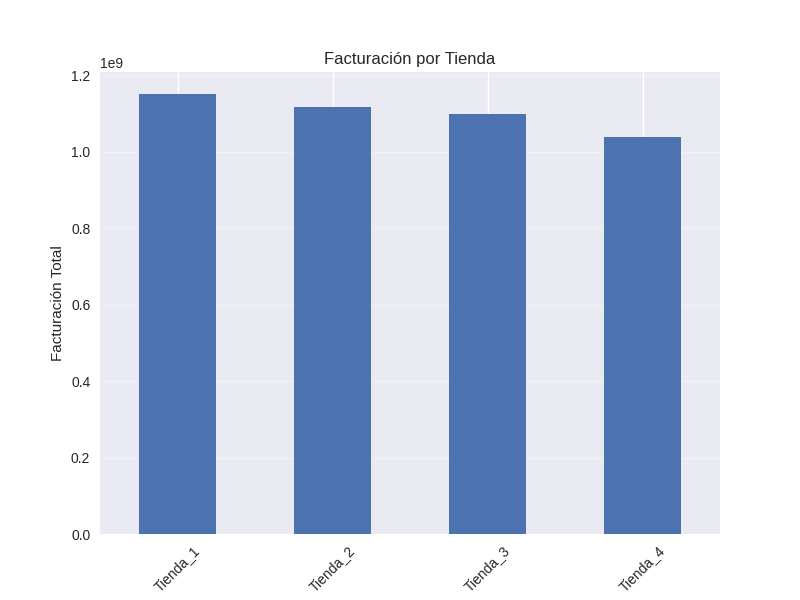
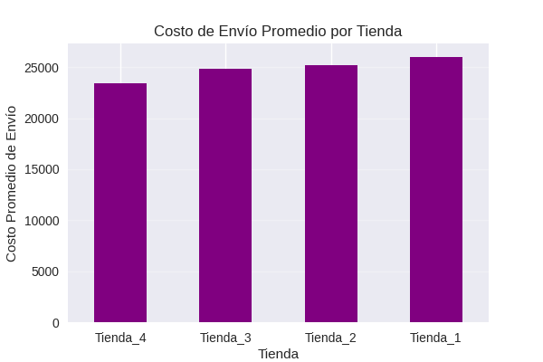

# 📑 Informe Final: Recomendación de Venta de Tienda para el Sr. Juan

**Autor:** Henry Valdez 

---

## 1. Introducción

El presente informe tiene como objetivo **apoyar al Sr. Juan en la decisión de qué tienda de la cadena Alura Store vender** para financiar su nuevo proyecto.  
El análisis incluye:

- Facturación total por tienda  
- Ventas por categoría de producto  
- Satisfacción del cliente  
- Productos más y menos vendidos  
- Costos logísticos promedio  

Se utilizaron **Python, pandas, Matplotlib y Seaborn** para procesar datos y generar visualizaciones.

---

## 2. Análisis de Datos

### 2.1 Facturación Total por Tienda

| Tienda    | Facturación (COP) |
|----------|-------------------|
| Tienda_1 | 1,150,880,000     |
| Tienda_2 | 1,116,344,000     |
| Tienda_3 | 1,098,020,000     |
| Tienda_4 | 1,038,376,000     |

**Análisis:**  
- **Tienda 1** lidera en ingresos totales.  
- **Tienda 4** es la de menor facturación, 9.8% inferior a Tienda 1.  
- Vender la tienda de menor ingreso permite liberar capital sin gran impacto.

---

### 2.2 Ventas por Categoría

**Top Categorías:**
1. Muebles – 1,886 ventas  
2. Electrónicos – 1,772 ventas  
3. Juguetes – 1,290 ventas  

**Análisis:**  
- Muebles y Electrónicos dominan las ventas.  
- Categorías menores como **Instrumentos musicales y Libros** son más riesgosas por baja rotación.  
- Tiendas con alta proporción de estas categorías suelen ser menos rentables.

---

### 2.3 Satisfacción del Cliente

| Tienda    | Calificación Promedio |
|----------|----------------------|
| Tienda_3 | 4.05 |
| Tienda_2 | 4.04 |
| Tienda_4 | 4.00 |
| Tienda_1 | 3.98 |

**Análisis:**  
- Todas las tiendas tienen **buen nivel de satisfacción (>3.9)**.  
- **Tienda 4**, aunque no es mala, no destaca frente a sus competidoras.  
- Su venta no afectará la reputación global de la cadena.

---

### 2.4 Productos Más y Menos Vendidos

**Top 5 más vendidos:**
1. Mesa de noche – 210  
2. Carrito de control remoto – 206  
3. Microondas – 206  
4. Batería – 203  
5. Cama king – 201  

**Bottom 5 menos vendidos:**
1. Ciencia de datos con Python – 166  
2. Guitarra eléctrica – 165  
3. Mochila – 163  
4. Auriculares con micrófono – 158  
5. Celular ABXY – 157  

**Análisis:**  
- Los productos de hogar sostienen la mayor parte de las ventas.  
- Los productos de nicho y tecnológicos tienen **rotación lenta**, afectando la liquidez.  
- Tienda 4 muestra **exposición alta a productos de baja rotación**.

---

### 2.5 Costos de Envío Promedio

| Tienda    | Costo Promedio (COP) |
|----------|----------------------|
| Tienda_4 | 23,459 |
| Tienda_3 | 24,805 |
| Tienda_2 | 25,216 |
| Tienda_1 | 26,018 |

**Análisis:**  
- **Tienda 4** tiene la logística más económica, lo que podría atraer a un comprador.  
- Sin embargo, su **baja facturación anula la ventaja de costos**.

---

## 3. Recomendación Final

**Recomendación:** Vender **Tienda 4**.

**Motivos clave:**
1. Menor facturación de la cadena  
2. Productos con rotación lenta  
3. Impacto mínimo sobre ingresos totales  
4. Logística eficiente que puede ser atractiva para un nuevo dueño

**Mensaje para el Sr. Juan:**  
Vender la **Tienda 4** es la opción más equilibrada.  
Le permitirá **obtener liquidez inmediata** sin comprometer el rendimiento global de su negocio.

---

## 4. Anexos

- Gráficos generados en `images/`  
- Notebook completo en `notebooks/`  

