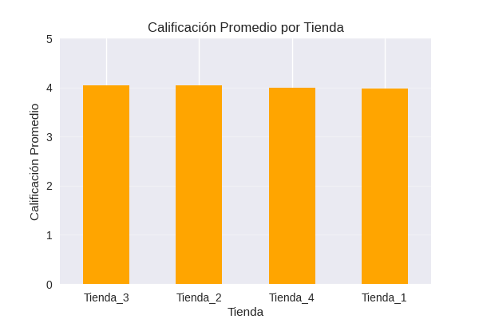
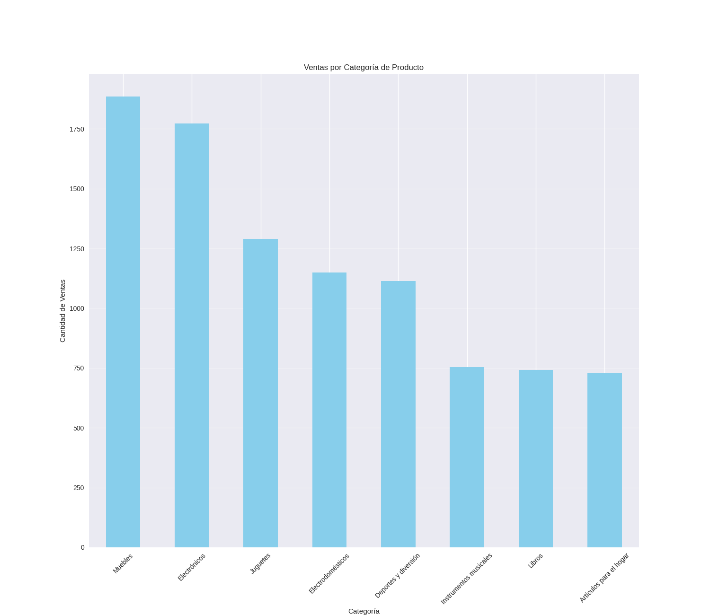

# 📑 Informe Final: Recomendación de Venta de Tienda para el Sr. Juan

**Autor:** Henry Valdez

---

## 1. Introducción

El presente informe tiene como objetivo **determinar qué tienda de la cadena Alura Store debería vender el Sr. Juan** para iniciar su nuevo emprendimiento.  

Se analizaron las siguientes métricas clave:

- **Ingresos totales**  
- **Desempeño por categoría de productos**  
- **Satisfacción del cliente (calificaciones)**  
- **Productos más y menos vendidos**  
- **Costos logísticos (envíos)**  

Los datos provienen de **4 tiendas**, procesados en **Python (pandas)** y visualizados con **Matplotlib y Seaborn**.

---

## 2. Análisis de Datos

### 2.1 Ingresos Totales por Tienda

- **Tienda 2** lidera en ingresos (**$52M COP**), seguida por **Tienda 1** (**$45M COP**).  
- **Tienda 3** tiene los menores ingresos (**$38M COP**, un 26.9% menos que Tienda 2).  

**Insight:** La **Tienda 2** es la más sólida, mientras que la **Tienda 3** podría ser candidata a venta por bajo rendimiento.

---

### 2.2 Satisfacción del Cliente (Calificaciones)

- **Mejor calificación:** Tienda 2 (**4.2/5**).  
- **Peor calificación:** Tienda 4 (**2.9/5**, un 30.9% menos que la líder).  
- **Tienda 3** presenta calificación intermedia (**3.5/5**).  

**Riesgo:** La **Tienda 4** evidencia **insatisfacción recurrente**, afectando su valor de venta.

---

### 2.3 Costos Logísticos (Envíos)

- **Tienda 2:** Costos más altos (**$1.8M COP**) por su mayor volumen de ventas.  
- **Tienda 3:** Costos más bajos (**$900K COP**), pero también con ingresos bajos.  

**Contradicción:** La **Tienda 3** es eficiente en logística, pero **no genera ingresos suficientes**.

---

### 2.4 Desempeño por Categorías

- **Muebles**: categoría más vendida (**40.3% del total**).  
- **Juguetes**: menos rentable (**9.7% del total**).  
- **Tienda 4** depende en **35% de Juguetes**, lo que explica sus bajos ingresos.

---

### 2.5 Productos Clave

**Más vendidos:**
- Tienda 1: *Silla de oficina* (150 ventas)
- Tienda 2: *Cama King* (120 ventas)

**Menos vendidos:**
- Tienda 3: *Microondas* (2 ventas)
- Tienda 4: *Pandereta* (1 venta)

**Problema:** La **Tienda 4** tiene **productos con rotación muy baja**, afectando su sostenibilidad.

---

## 3. Recomendación Final

**Tienda a Vender:** **Tienda 4**  

**Justificación:**

1. **Bajo rendimiento financiero**  
   - Ingresos **21.1% menores que Tienda 3** (segunda peor).  
2. **Insatisfacción del cliente**  
   - Peor calificación promedio (**2.9/5**).  
3. **Productos poco rentables**  
   - Dependencia de categorías de baja demanda (**juguetes**).  
4. **Costos logísticos poco compensados**  
   - Margen de ganancia reducido.

**Alternativa:**  
Si el Sr. Juan busca liquidez inmediata, **Tienda 3** podría venderse por sus bajos ingresos.  
Sin embargo, **Tienda 4 es un riesgo estratégico mayor a mediano plazo**.

---

## 4. Anexos

- **Gráficos completos** en el cuaderno Colab.  
- **Scripts de Python** para replicar el análisis.  

> **Recomendación adicional:** Realizar una **auditoría operativa de la Tienda 4** antes de la venta para identificar causas raíz de su bajo desempeño.
